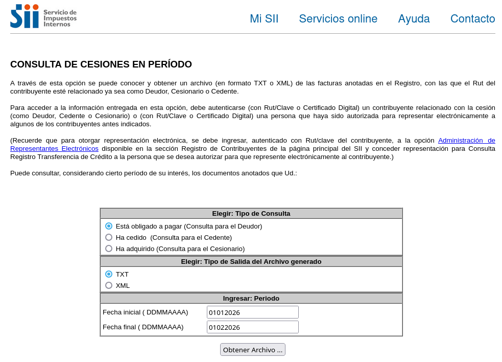

# CONSULTA DE CESIONES EN PERÍODO

## DESCRIPCIÓN DE LA API:

A través de esta Api se puede conocer y obtener un archivo en formato Json con las facturas anotadas en el Registro,  
con las que el Rut del contribuyente esté relacionado ya sea como Deudor, Cesionario o Cedente.

Para acceder a la información entregada en esta Api se requiere Rut y Clave del contribuyente relacionado con la cesión.  
Ya sea como Deudor, Cedente o Cesionario.



## URL DEL ENDPOINT:

https://cesiones.factronica.cl

## PASOS A SEGUIR PARA LA INTEGRACIÓN:

A continuación se detalla el procedimiento a realizar en la integración.

- Paso 01.-Crear datos json
- Paso 02.-Enviar datos Json al endpoint
- Paso 03.-Procesar Respuesta Json

## FORMATO JSON PETICIÓN:

```
{
    "ApiKey" : "abc123",
    "Rut" : "11222333-4",
    "ClaveSii" : "abc123",
    "Desde" : "DDMMAAAA",
    "Hasta" : "DDMMAAAA",
    "Formato" : "TXT",
    "TipoConsulta" : "0"
}
```

## FORMATO JSON RESPUESTA SATISFACTORIA:

```
{
  "Codigo": 200,
  "Estado": "OK",
  "EncabezadoCSV": {
    "Linea1_DATOS_CONSULTA": {
      "RUT": "78095717-4",
      "TIPO_CONSULTA": "DEUDOR",
      "DESDE_DDMMAAAA": "01012026",
      "HASTA_DDMMAAAA": "01022026"
    },
    "Linea2_COLUMNAS": [
      "VENDEDOR",
      "ESTADO_CESION",
      "DEUDOR",
      "MAIL_DEUDOR",
      "TIPO_DOC",
      "NOMBRE_DOC",
      "FOLIO_DOC",
      "FCH_EMIS_DTE",
      "MNT_TOTAL",
      "CEDENTE",
      "RZ_CEDENTE",
      "MAIL_CEDENTE",
      "CESIONARIO",
      "RZ_CESIONARIO",
      "MAIL_CESIONARIO",
      "FCH_CESION",
      "MNT_CESION",
      "FCH_VENCIMIENTO"
    ]
  },
  "CantidadRegistros": 3,
  "Registros": [
    {
      "VENDEDOR": "76000001-9",
      "ESTADO_CESION": "CEDIDO",
      "DEUDOR": "96543210-5",
      "MAIL_DEUDOR": "contacto@empresa1.cl",
      "TIPO_DOC": "33",
      "NOMBRE_DOC": "FACTURA ELECTRONICA",
      "FOLIO_DOC": "1001",
      "FCH_EMIS_DTE": "05012026",
      "MNT_TOTAL": "1500000",
      "CEDENTE": "76000001-9",
      "RZ_CEDENTE": "COMERCIAL ABC SPA",
      "MAIL_CEDENTE": "ventas@abc.cl",
      "CESIONARIO": "77000002-3",
      "RZ_CESIONARIO": "FACTORING XYZ SPA",
      "MAIL_CESIONARIO": "operaciones@xyz.cl",
      "FCH_CESION": "10012026",
      "MNT_CESION": "1500000",
      "FCH_VENCIMIENTO": "05022026"
    },
    {
      "VENDEDOR": "76000002-7",
      "ESTADO_CESION": "NO CEDIDO",
      "DEUDOR": "91234567-8",
      "MAIL_DEUDOR": "finanzas@empresa2.cl",
      "TIPO_DOC": "33",
      "NOMBRE_DOC": "FACTURA ELECTRONICA",
      "FOLIO_DOC": "1002",
      "FCH_EMIS_DTE": "08012026",
      "MNT_TOTAL": "890000",
      "CEDENTE": "76000002-7",
      "RZ_CEDENTE": "SERVICIOS INDUSTRIALES LMDA",
      "MAIL_CEDENTE": "contacto@lmda.cl",
      "CESIONARIO": "",
      "RZ_CESIONARIO": "",
      "MAIL_CESIONARIO": "",
      "FCH_CESION": "",
      "MNT_CESION": "",
      "FCH_VENCIMIENTO": "08022026"
    },
    {
      "VENDEDOR": "76000003-5",
      "ESTADO_CESION": "CEDIDO",
      "DEUDOR": "93456789-1",
      "MAIL_DEUDOR": "admin@empresa3.cl",
      "TIPO_DOC": "34",
      "NOMBRE_DOC": "FACTURA NO AFECTA O EXENTA ELECTRONICA",
      "FOLIO_DOC": "2050",
      "FCH_EMIS_DTE": "15012026",
      "MNT_TOTAL": "2450000",
      "CEDENTE": "76000003-5",
      "RZ_CEDENTE": "IMPORTADORA DEL SUR LTDA",
      "MAIL_CEDENTE": "ventas@delsur.cl",
      "CESIONARIO": "77000005-8",
      "RZ_CESIONARIO": "FACTORING FINANZAS SPA",
      "MAIL_CESIONARIO": "contacto@finanzas.cl",
      "FCH_CESION": "18012026",
      "MNT_CESION": "2400000",
      "FCH_VENCIMIENTO": "15022026"
    }
  ]
}
```
